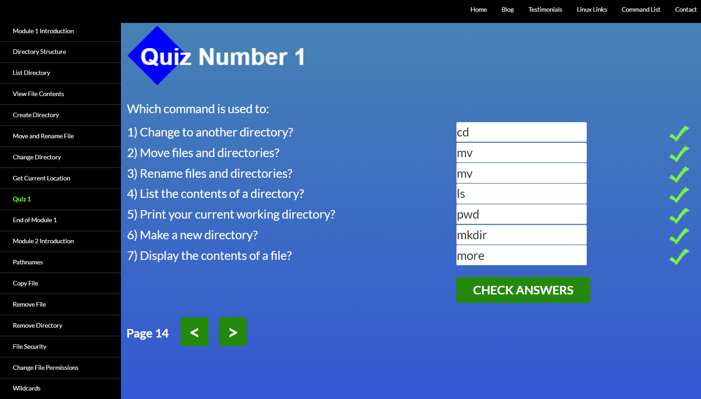
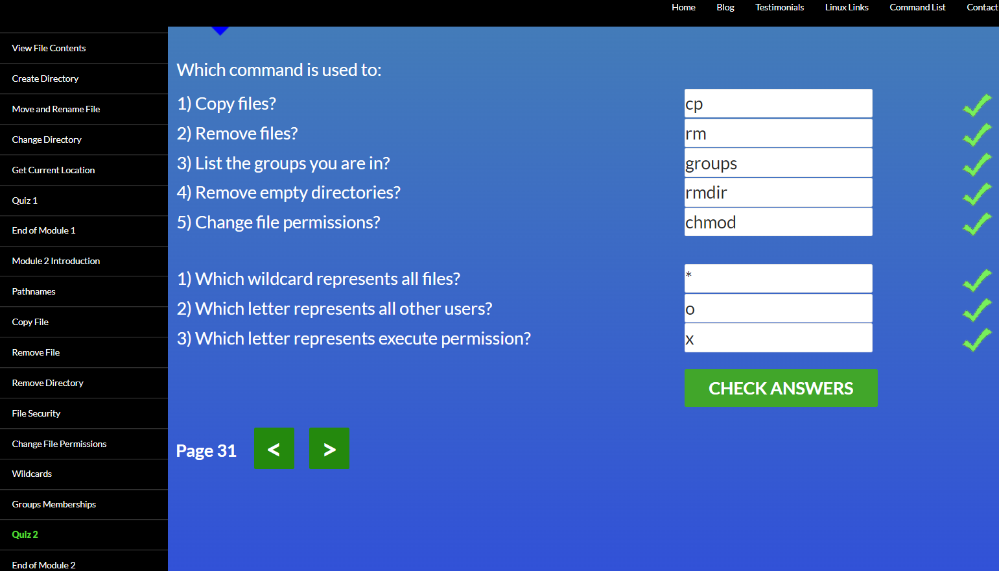
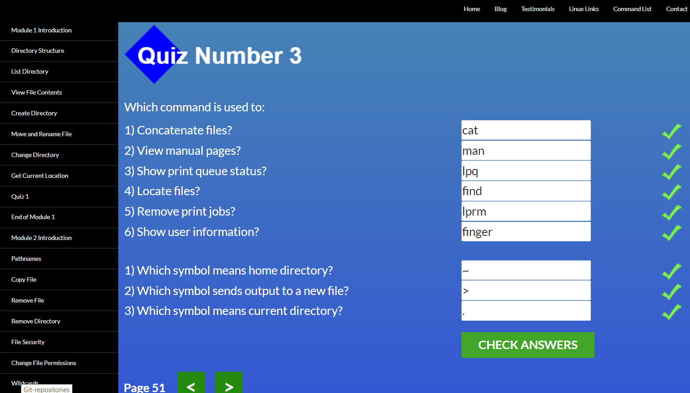
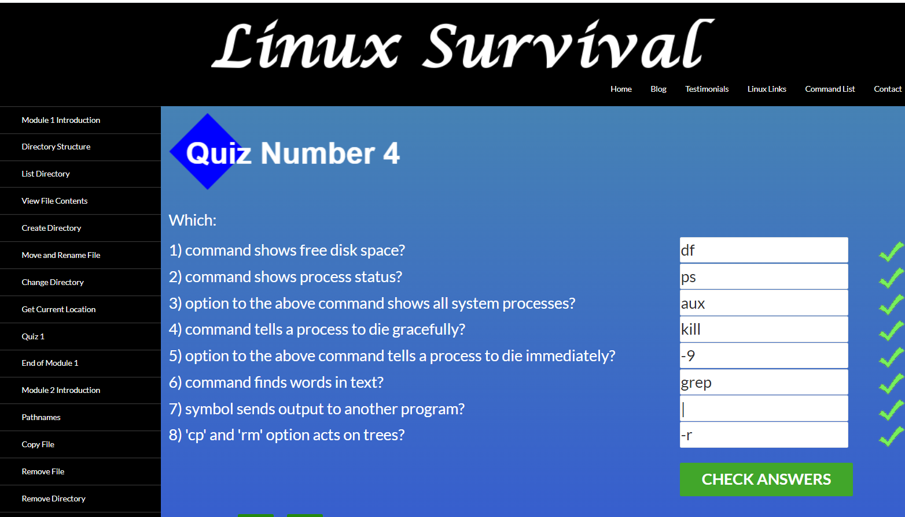

## kottans-frontend

Hello my name Petro.
I am from Ternopil (Ukraine). I am beginner frontend developer.

## GIT Basics

The impressions of the material learned are very good.
I installed and run Git on a local machine.
Also, I created my first repository, clone origin repository, made commits.
I understood why version control is the main tool for coding and collaboration.

## Linux, Command Line, HTTP Tools

I had no experience working with linux and also with the Linux command line,
so the course was very useful for me. It is convenient and fast to get information
by knowing the basic commands. I was already familiar with the basics of HTTP,
but the articles expanded my knowledge about him. Very interesting and useful.

